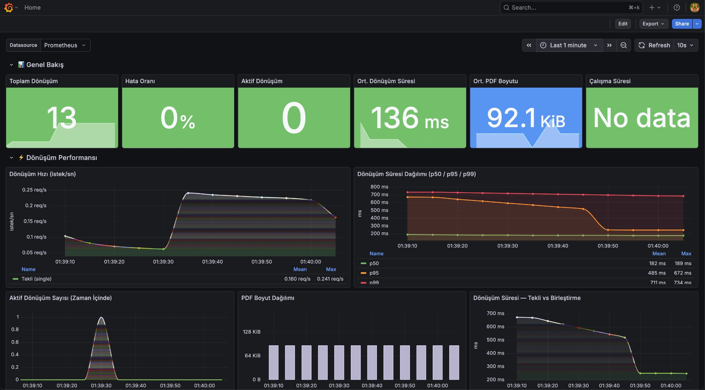

# MERSEL.Services.HtmlToPdf

[Playwright](https://playwright.dev/) (Chromium) ve [PdfSharpCore](https://github.com/ststeiger/PdfSharpCore) ile geliştirilmiş, hafif ve yüksek kaliteli **HTML → PDF dönüşüm mikroservisi**.

[](https://dotnet.microsoft.com/download/dotnet/9.0)
[](LICENSE)
[](https://www.nuget.org/packages/MERSEL.Services.HtmlToPdf.Client)
[](https://github.com/mersel-io/MERSEL.Services.HtmlToPdf/actions/workflows/ci.yml)

## Neden Bu Servis?

PDF oluşturma, CPU ve bellek yoğun bir işlemdir. Bu servisi **bağımsız bir mikroservis** olarak çalıştırarak:

- **Ana uygulamanızdan yükü alırsınız** — PDF oluşturma işlemi izole edilir, ana servisleriniz etkilenmez
- **Yatay ölçeklendirme yaparsınız** — Yoğun dönemlerde (ay sonu fatura kesimi, toplu rapor vb.) birden fazla instance ayağa kaldırarak yüksek hacimli talepleri karşılarsınız
- **Kaynak sınırlarını bağımsız yönetirsiniz** — PDF servisine 1 GB bellek, ana uygulamanıza 512 MB gibi bağımsız limitler tanımlayabilirsiniz
- **wkhtmltopdf'den modern altyapıya geçersiniz** — Playwright'ın headless Chromium motoru ile tam CSS3, Flexbox, Grid ve JavaScript desteği alırsınız

> **Tek instance ile başlayın, ihtiyaç büyüdükçe replica sayısını artırın.** Servis tamamen stateless çalışır; load balancer arkasında istediğiniz kadar kopya çalıştırabilirsiniz.

## Özellikler

- **Tekli HTML → PDF** — Tam CSS/JS desteğiyle her türlü HTML belgesini PDF'e dönüştürür
- **Çoklu HTML → Birleştirilmiş PDF** — Birden fazla HTML'i tek PDF'te birleştirir (wkhtmltopdf'in çoklu girdi davranışı)
- **Chromium Render** — Playwright'ın headless Chromium motoru ile piksel mükemmelliğinde çıktı
- **PDF Birleştirme** — PdfSharpCore ile çoklu belge birleştirme
- **Otomatik Tarayıcı Kurulumu** — Chromium ilk çalıştırmada otomatik indirilir ve kurulur
- **İstemci SDK'sı** — .NET tüketicileri için hazır NuGet paketi
- **Scalar API Dokümantasyonu** — `/scalar/v1` adresinde etkileşimli API referansı
- **Docker Hazır** — Sağlık kontrolü dahil üretime hazır Dockerfile
- **Kapsamlı Testler** — 73 test (birim, entegrasyon, performans/stres — gerçek e-fatura şablonlarıyla)

## Mimari

```
MERSEL.Services.HtmlToPdf/
├── src/
│   ├── Application/       # Temel arayüz (IHtmlToPdfConverter) — net8.0;net9.0
│   ├── Infrastructure/    # Playwright + PdfSharpCore implementasyonu — net9.0
│   ├── Web/               # Minimal API sunucusu — net9.0
│   └── Client/            # Tüketici HTTP istemci SDK'sı — net8.0
├── tests/
│   ├── Shared/            # Ortak test araçları (HtmlSamples, PdfAssert)
│   ├── Converter.Tests/   # PlaywrightPdfConverter birim ve entegrasyon testleri
│   └── Api.Tests/         # API endpoint, İstemci SDK ve DI testleri
├── monitoring/
│   ├── docker-compose.yml       # Prometheus + Grafana + HtmlToPdf
│   ├── prometheus/prometheus.yml # Scrape yapılandırması
│   └── grafana/
│       ├── dashboards/htmltopdf.json  # Otomatik yüklenen dashboard
│       └── provisioning/              # Datasource ve dashboard provisionları
├── Dockerfile
├── LICENSE
└── MERSEL.Services.HtmlToPdf.sln
```

## Hızlı Başlangıç

### Gereksinimler

- [.NET 9 SDK](https://dotnet.microsoft.com/download/dotnet/9.0) veya üzeri

### Servisi Çalıştırma

```bash
dotnet run --project src/Web
```

Servis `http://localhost:5090` adresinde başlar. İlk çalıştırmada Playwright otomatik olarak Chromium'u indirir.

### API Endpoint'leri

| Metod | Adres | Açıklama |
|-------|-------|----------|
| `GET` | `/health` | Sağlık kontrolü (Chromium durumu dahil) |
| `POST` | `/convert` | Tek HTML → PDF dönüşümü |
| `POST` | `/convert/merge` | Çoklu HTML → Birleştirilmiş PDF |
| `GET` | `/metrics` | Prometheus metrikleri |
| `GET` | `/scalar/v1` | Scalar API dokümantasyon arayüzü |
| `GET` | `/openapi/v1.json` | OpenAPI spesifikasyonu (JSON) |

#### Sağlık Kontrolü

```bash
curl http://localhost:5090/health
# {"status":"Healthy","service":"HtmlToPdf","duration":0.42,"checks":[{"name":"chromium","status":"Healthy",...}]}
```

#### Tek HTML'i PDF'e Dönüştürme

```bash
# Varsayılan ayarlarla
curl -X POST http://localhost:5090/convert \
  -F "file=@fatura.html" \
  -o cikti.pdf

# PDF ayarlarını query string ile göndererek
curl -X POST "http://localhost:5090/convert?smartShrinking=true&jsDelay=2000" \
  -F "file=@fatura.html" \
  -o cikti.pdf

# Landscape, özel kenar boşlukları
curl -X POST "http://localhost:5090/convert?landscape=true&marginTop=25mm&marginBottom=25mm" \
  -F "file=@rapor.html" \
  -o rapor.pdf
```

#### Birden Fazla HTML'i Tek PDF'te Birleştirme

```bash
curl -X POST http://localhost:5090/convert/merge \
  -F "files=@sayfa1.html" \
  -F "files=@sayfa2.html" \
  -F "files=@sayfa3.html" \
  -o birlesmis.pdf
```

## Entegrasyon

Bu servis standart bir **HTTP/REST API**'dir. Herhangi bir programlama dili veya platform üzerinden `multipart/form-data` POST isteği göndererek kullanılabilir — Python, Java, Go, Node.js, PHP, Ruby, cURL, Postman veya herhangi bir HTTP istemcisi ile entegre olur.

.NET projeleri için hazır bir istemci SDK'sı da sunulmaktadır:

### İstemci SDK'sı (NuGet — .NET)

Servisinizi kendi ortamınızda çalıştırdıktan sonra, .NET uygulamalarınızdan PDF dönüşümünü çağırmak için istemci SDK paketini kurun:

```bash
dotnet add package MERSEL.Services.HtmlToPdf.Client
```

Bu paket, `IHtmlToPdfConverter` arayüzü ve HTTP istemci implementasyonunu içerir. Sadece arayüz katmanına ihtiyacınız varsa:

```bash
dotnet add package MERSEL.Services.HtmlToPdf.Application
```

| Paket | Açıklama | Hedef Framework |
|-------|----------|-----------------|
| `MERSEL.Services.HtmlToPdf.Client` | HTTP istemci SDK'sı + DI uzantıları | net8.0 |
| `MERSEL.Services.HtmlToPdf.Application` | Sadece `IHtmlToPdfConverter` arayüzü | net8.0, net9.0 |

### DI Kaydı

```csharp
// Seçenek 1: Yapılandırma dosyasından (appsettings.json)
builder.Services.AddHtmlToPdfClient(builder.Configuration);

// Seçenek 2: Doğrudan URL belirterek
builder.Services.AddHtmlToPdfClient("http://htmltopdf-service:8080");
```

**appsettings.json:**

```json
{
  "Services": {
    "HtmlToPdf": {
      "BaseUrl": "http://localhost:5090"
    }
  }
}
```

### Kullanım

```csharp
public class FaturaServisi(IHtmlToPdfConverter pdfConverter)
{
    // ── Basit kullanım (varsayılan ayarlar: A4, dikey, arka plan açık) ──

    public async Task<byte[]> FaturaPdfOlustur(string htmlIcerik)
    {
        var htmlBytes = Encoding.UTF8.GetBytes(htmlIcerik);
        return await pdfConverter.ConvertAsync(htmlBytes);
    }

    // ── wkhtmltopdf uyumlu preset ile (akıllı küçültme + JS bekleme) ──

    public async Task<byte[]> EFaturaPdfOlustur(string htmlIcerik)
    {
        var htmlBytes = Encoding.UTF8.GetBytes(htmlIcerik);
        return await pdfConverter.ConvertAsync(htmlBytes, PdfConvertOptions.WkHtmlCompatible);
    }

    // ── Özel ayarlarla ──

    public async Task<byte[]> RaporPdfOlustur(string htmlIcerik)
    {
        var htmlBytes = Encoding.UTF8.GetBytes(htmlIcerik);
        return await pdfConverter.ConvertAsync(htmlBytes, new PdfConvertOptions
        {
            Landscape = true,
            MarginTop = "25mm",
            MarginBottom = "25mm",
            SmartShrinking = true,
            JavaScriptDelayMs = 2000
        });
    }

    // ── Birden fazla HTML'i tek PDF'te birleştirme ──

    public async Task<byte[]> TopluFaturaPdfOlustur(List<string> htmlSayfalar)
    {
        var htmlByteList = htmlSayfalar.Select(Encoding.UTF8.GetBytes);
        return await pdfConverter.ConvertAndMergeAsync(htmlByteList);
    }
}
```

### Hazır Preset'ler

| Preset | Açıklama |
|--------|----------|
| `PdfConvertOptions.WkHtmlCompatible` | wkhtmltopdf uyumlu: akıllı küçültme, JS bekleme (2sn), dar kenar boşlukları |
| `PdfConvertOptions.WkHtmlMergeCompatible` | Birleştirme için: daha uzun JS bekleme (5sn) |
| `new PdfConvertOptions()` | Varsayılan: A4, dikey, ölçek 1.0, arka plan açık |

### Tüm Ayarlar (Query String / PdfConvertOptions)

| Parametre | Tip | Varsayılan | Açıklama |
|-----------|-----|-----------|----------|
| `format` | string | `A4` | Kağıt boyutu (A3, A4, A5, Letter, Legal, Tabloid) |
| `landscape` | bool | `false` | Yatay sayfa yönü |
| `scale` | float | `1.0` | Render ölçek faktörü (0.1 – 2.0) |
| `printBackground` | bool | `true` | Arka plan renk/resimlerini yazdır |
| `marginTop` | string | `10mm` | Üst kenar boşluğu (mm, cm, in, px) |
| `marginBottom` | string | `10mm` | Alt kenar boşluğu |
| `marginLeft` | string | `5mm` | Sol kenar boşluğu |
| `marginRight` | string | `5mm` | Sağ kenar boşluğu |
| `displayHeaderFooter` | bool | `false` | Header/Footer şablonu göster |
| `headerTemplate` | string | — | Header HTML şablonu |
| `footerTemplate` | string | — | Footer HTML şablonu |
| `jsDelay` | int | — | JavaScript bekleme süresi (ms) |
| `waitForNetworkIdle` | bool | `false` | Ağ istekleri tamamlanana kadar bekle |
| `smartShrinking` | bool | `false` | İçerik taşarsa otomatik küçült (wkhtmltopdf uyumu) |
| `preferCssPageSize` | bool | `false` | CSS @page boyutunu tercih et |
| `pageRanges` | string | — | Sayfa aralıkları (ör: "1-5", "1,3,5-9") |
| `width` | string | — | Özel sayfa genişliği (ör: "210mm") |
| `height` | string | — | Özel sayfa yüksekliği (ör: "297mm") |

## Docker

### Derleme ve Çalıştırma

```bash
docker build -t mersel-htmltopdf .
docker run -p 5090:8080 mersel-htmltopdf
```

### Docker Compose — Tek Instance

```yaml
services:
  htmltopdf:
    build: .
    ports:
      - "5090:8080"
    healthcheck:
      test: ["CMD", "curl", "-f", "http://localhost:8080/health"]
      interval: 30s
      timeout: 10s
      retries: 3
    deploy:
      resources:
        limits:
          memory: 1G
```

### Docker Compose — Yatay Ölçeklendirme (3 Replica)

Yoğun yük altında birden fazla instance çalıştırarak performansı artırabilirsiniz.
Servis tamamen **stateless** olduğu için load balancer arkasında sorunsuz ölçeklenir.

```yaml
services:
  htmltopdf:
    build: .
    deploy:
      replicas: 3
      resources:
        limits:
          memory: 1G
    healthcheck:
      test: ["CMD", "curl", "-f", "http://localhost:8080/health"]
      interval: 30s
      timeout: 10s
      retries: 3

  nginx:
    image: nginx:alpine
    ports:
      - "5090:80"
    volumes:
      - ./nginx.conf:/etc/nginx/conf.d/default.conf
    depends_on:
      - htmltopdf
```

> **İpucu:** Kubernetes ortamında `HorizontalPodAutoscaler` ile CPU kullanımına göre otomatik ölçeklendirme yapabilirsiniz.

## CI/CD

Proje GitHub Actions ile otomatik CI/CD süreçlerine sahiptir:

| Workflow | Tetikleyici | Açıklama |
|----------|-------------|----------|
| **CI** | `push` / `PR` → `main` | Build, test, NuGet paket doğrulama |
| **Release** | `v*` tag push | NuGet yayınlama + Docker image push + GitHub Release |

### Yeni Versiyon Yayınlama

```bash
# Versiyonu belirle ve tag oluştur
git tag v1.2.0
git push origin v1.2.0
```

Bu komutlar otomatik olarak şunları tetikler:
1. Tüm testleri çalıştırır
2. `MERSEL.Services.HtmlToPdf.Application` ve `MERSEL.Services.HtmlToPdf.Client` paketlerini **nuget.org**'a yayınlar
3. Docker image'ı **ghcr.io**'ya push eder (`latest` + semver tagları)
4. GitHub Release oluşturur (release notes + NuGet paketleri eki)

> **Gerekli Secret:** Repository Settings → Secrets → `NUGET_API_KEY` (nuget.org API anahtarı)

## Testleri Çalıştırma

```bash
# Tüm testler
dotnet test

# Sadece dönüştürücü testleri
dotnet test tests/Converter.Tests

# Sadece API testleri
dotnet test tests/Api.Tests
```

> **Not:** Testler Playwright Chromium gerektirir. İlk çalıştırmada otomatik olarak kurulur.

## Yapılandırma

| Ayar | Varsayılan | Açıklama |
|------|-----------|----------|
| `ASPNETCORE_URLS` | `http://+:8080` (Docker) | Dinleme adresi |
| `Serilog:MinimumLevel:Default` | `Information` | Log seviyesi |
| `Services:HtmlToPdf:BaseUrl` | `http://localhost:5090` | İstemci SDK temel URL'si |

## PDF Çıktı Ayarları

Varsayılan PDF render ayarları:

| Ayar | Değer | Açıklama |
|------|-------|----------|
| Kağıt Boyutu | A4 | `format` parametresiyle değiştirilebilir |
| Arka Plan Yazdırma | Açık | CSS arka plan renkleri ve resimleri dahil edilir |
| Üst/Alt Kenar Boşluğu | 10mm | Header/footer kullanılıyorsa artırın |
| Sol/Sağ Kenar Boşluğu | 5mm | — |
| Akıllı Küçültme | Kapalı | `smartShrinking=true` ile etkinleştirin |

> **wkhtmltopdf'den geçiş yapıyorsanız:** `PdfConvertOptions.WkHtmlCompatible` preset'ini veya `?smartShrinking=true&jsDelay=2000` parametrelerini kullanın. Bu, eski `--enable-smart-shrinking` davranışını birebir karşılar.

## wkhtmltopdf'den Geçiş

Mevcut `wkhtmltopdf` kullanan projenizi bu servise geçirmek için:

### 1. Servisi ayağa kaldırın

```bash
docker run -p 5090:8080 mersel-htmltopdf
```

### 2. NuGet paketini kurun

```bash
dotnet add package MERSEL.Services.HtmlToPdf.Client
```

### 3. DI'a kaydedin

```csharp
builder.Services.AddHtmlToPdfClient("http://localhost:5090");
```

### 4. Eski kodu değiştirin

```csharp
// ── Önce (wkhtmltopdf) ──
var converter = new WkHtmlToPdfConverter();
var pdf = converter.Convert(htmlString, "--page-size A4 --enable-smart-shrinking ...");

// ── Sonra (MERSEL.Services.HtmlToPdf) ──
public class FaturaServisi(IHtmlToPdfConverter pdfConverter)
{
    public async Task<byte[]> Olustur(string html)
    {
        var htmlBytes = Encoding.UTF8.GetBytes(html);
        return await pdfConverter.ConvertAsync(htmlBytes, PdfConvertOptions.WkHtmlCompatible);
    }
}
```

### wkhtmltopdf → Yeni Parametre Karşılıkları

| wkhtmltopdf | Bu servis | Açıklama |
|-------------|-----------|----------|
| `--page-size A4` | `format=A4` | Kağıt boyutu |
| `--orientation Landscape` | `landscape=true` | Sayfa yönü |
| `--enable-smart-shrinking` | `smartShrinking=true` | İçerik taşmasını otomatik küçültme |
| `--javascript-delay 2000` | `jsDelay=2000` | JS çalışması için bekleme süresi |
| `--margin-top 5` | `marginTop=5mm` | Üst kenar boşluğu |
| `--margin-bottom 5` | `marginBottom=5mm` | Alt kenar boşluğu |
| `--margin-left 0` | `marginLeft=0mm` | Sol kenar boşluğu |
| `--margin-right 1` | `marginRight=1mm` | Sağ kenar boşluğu |
| `--print-media-type` | `printBackground=true` | Arka plan yazdırma (varsayılan açık) |
| `--header-html ...` | `headerTemplate=<html>...` | Sayfa üst bilgisi |
| `--footer-html ...` | `footerTemplate=<html>...` | Sayfa alt bilgisi |
| `--quiet` | — | Playwright sessiz çalışır |
| Birden fazla HTML girdi | `/convert/merge` endpoint | Çoklu HTML → tek PDF |

## Teknoloji Yığını

| Bileşen | Teknoloji |
|---------|-----------|
| Çalışma Zamanı | .NET 9 |
| HTML Render | Playwright (Chromium) |
| PDF Birleştirme | PdfSharpCore |
| Loglama | Serilog |
| API | Minimal API |
| Dokümantasyon | Scalar (OpenAPI) |
| Metrikler | OpenTelemetry + Prometheus |
| Test | xUnit, FluentAssertions |

## Observability (İzlenebilirlik)

Servis, operasyon ve izleme (O&M) için kapsamlı observability altyapısı sunar.

### Hazır Monitoring Stack (Prometheus + Grafana)

Proje ile birlikte gelen `monitoring/` klasörü, tek komutla tam bir izleme ortamı kurar:

```bash
cd monitoring
docker compose up -d --build
```

| Servis | Adres | Açıklama |
|--------|-------|----------|
| **HtmlToPdf** | http://localhost:5090 | API servisi |
| **Prometheus** | http://localhost:9090 | Metrik toplama ve sorgulama |
| **Grafana** | http://localhost:3000 | Dashboard arayüzü (`admin` / `htmltopdf`) |

Grafana açıldığında **MERSEL HtmlToPdf** dashboard'u otomatik olarak yüklüdür — hiçbir ayar yapmanıza gerek yok.



### Dashboard İçeriği

Dashboard 4 satırlık bölümden oluşur:

**Genel Bakış** — Toplam dönüşüm, hata oranı (%), aktif dönüşüm, ortalama süre, ortalama PDF boyutu, çalışma süresi

**Dönüşüm Performansı** — İstek hızı (tekli/birleştirme/hata), süre dağılımı (p50/p95/p99), aktif dönüşüm zaman serisi, PDF boyut dağılımı, tekli vs birleştirme karşılaştırması

**HTTP İstekleri** — Durum koduna göre istek hızı (2xx/4xx/5xx), HTTP yanıt süresi (p50/p95/p99), endpoint bazında trafik, aktif HTTP istekleri

**.NET Runtime** — GC heap boyutu, GC koleksiyon sayısı (Gen 0/1/2), thread pool, proses bellek kullanımı (RSS/sanal/.NET heap), CPU kullanımı

### Prometheus Metrikleri (`/metrics`)

```bash
curl http://localhost:5090/metrics
```

| Metrik (Prometheus adı) | Tip | Açıklama |
|--------------------------|-----|----------|
| `htmltopdf_conversions_total` | Counter | Toplam başarılı dönüşüm sayısı (etiket: `type=single\|merge`) |
| `htmltopdf_conversions_errors_total` | Counter | Başarısız dönüşüm sayısı (etiket: `type`) |
| `htmltopdf_conversion_duration_milliseconds` | Histogram | Dönüşüm süresi — `_bucket`, `_sum`, `_count` |
| `htmltopdf_pdf_size_bytes` | Histogram | Oluşturulan PDF boyutu — `_bucket`, `_sum`, `_count` |
| `htmltopdf_conversions_active` | Gauge | Devam eden aktif dönüşüm sayısı |
| `http_server_request_duration_seconds` | Histogram | HTTP istek süresi (ASP.NET Core) |
| `http_server_active_requests` | Gauge | Aktif HTTP bağlantı sayısı |
| `process_runtime_dotnet_gc_*` | Çeşitli | .NET GC koleksiyon ve heap metrikleri |
| `process_runtime_dotnet_thread_pool_*` | Çeşitli | Thread pool boyutu ve kuyruk metrikleri |
| `process_cpu_seconds_total` | Counter | CPU kullanım süresi |
| `process_resident_memory_bytes` | Gauge | Fiziksel bellek (RSS) kullanımı |

### Sağlık Kontrolü (`/health`)

Health check endpoint'i, Chromium tarayıcısının bağlantı durumunu da raporlar:

```json
{
  "status": "Healthy",
  "service": "HtmlToPdf",
  "duration": 0.42,
  "checks": [
    {
      "name": "chromium",
      "status": "Healthy",
      "description": "Chromium tarayıcısı bağlı ve hazır",
      "duration": 0.12
    }
  ]
}
```

> **Kubernetes** ortamında `/health` endpoint'ini `livenessProbe` ve `readinessProbe` olarak kullanabilirsiniz.

### Dağıtık İzleme (Distributed Tracing)

Her dönüşüm işlemi `MERSEL.Services.HtmlToPdf` ActivitySource ile bir span oluşturur. OpenTelemetry Collector ile Jaeger, Zipkin veya başka bir trace backend'e aktarılabilir.

### Faydalı PromQL Sorguları

| Ne İçin | PromQL |
|---------|--------|
| Dönüşüm hızı (istek/sn) | `sum(rate(htmltopdf_conversions_total[5m]))` |
| Hata oranı (%) | `sum(rate(htmltopdf_conversions_errors_total[5m])) / sum(rate(htmltopdf_conversions_total[5m])) * 100` |
| p95 dönüşüm süresi | `histogram_quantile(0.95, sum(rate(htmltopdf_conversion_duration_milliseconds_bucket[5m])) by (le))` |
| Ortalama PDF boyutu | `rate(htmltopdf_pdf_size_bytes_sum[5m]) / rate(htmltopdf_pdf_size_bytes_count[5m])` |
| Aktif dönüşümler | `htmltopdf_conversions_active` |
| CPU kullanımı | `rate(process_cpu_seconds_total{job="htmltopdf"}[1m])` |
| Bellek kullanımı | `process_resident_memory_bytes{job="htmltopdf"}` |

### Alerting Kuralları (Önerilen)

```yaml
# prometheus/alert-rules.yml (isteğe bağlı)
groups:
  - name: htmltopdf
    rules:
      - alert: HighErrorRate
        expr: sum(rate(htmltopdf_conversions_errors_total[5m])) / sum(rate(htmltopdf_conversions_total[5m])) > 0.05
        for: 5m
        labels: { severity: critical }
        annotations: { summary: "HtmlToPdf hata oranı %5'i aştı" }

      - alert: SlowConversions
        expr: histogram_quantile(0.95, sum(rate(htmltopdf_conversion_duration_milliseconds_bucket[5m])) by (le)) > 5000
        for: 5m
        labels: { severity: warning }
        annotations: { summary: "HtmlToPdf p95 dönüşüm süresi 5 saniyeyi aştı" }

      - alert: HighMemoryUsage
        expr: process_resident_memory_bytes{job="htmltopdf"} > 800e6
        for: 5m
        labels: { severity: warning }
        annotations: { summary: "HtmlToPdf bellek kullanımı 800 MB'ı aştı" }
```

## Performans Notları

- **Chromium Singleton** — Tarayıcı uygulama ömrü boyunca tek instance olarak ayakta kalır; her istek için yeniden başlatılmaz
- **Context İzolasyonu** — Her dönüşüm isteği kendi tarayıcı context'inde çalışır; istekler birbirini etkilemez
- **Eşzamanlılık** — Tek bir instance birden fazla eşzamanlı isteği karşılayabilir
- **Stateless** — Hiçbir durum (state) saklamaz; istediğiniz kadar replica çalıştırabilirsiniz
- **Tipik Performans** — Tek sayfalık bir fatura HTML'i ~50-100ms'de PDF'e dönüşür

## Katkıda Bulunma

1. Repoyu fork'layın
2. Feature branch oluşturun (`git checkout -b feature/harika-ozellik`)
3. Değişikliklerinizi commit'leyin (`git commit -m 'Harika özellik ekle'`)
4. Branch'i push'layın (`git push origin feature/harika-ozellik`)
5. Pull Request açın

Lütfen şunlardan emin olun:
- Tüm testler geçiyor (`dotnet test`)
- Kod `.editorconfig` kurallarına uyuyor
- Yeni özellikler uygun testlerle birlikte ekleniyor

## Lisans

Bu proje MIT Lisansı ile lisanslanmıştır — detaylar için [LICENSE](LICENSE) dosyasına bakın.

---

[Mersel](https://mersel.io) tarafından özenle geliştirilmiştir.
